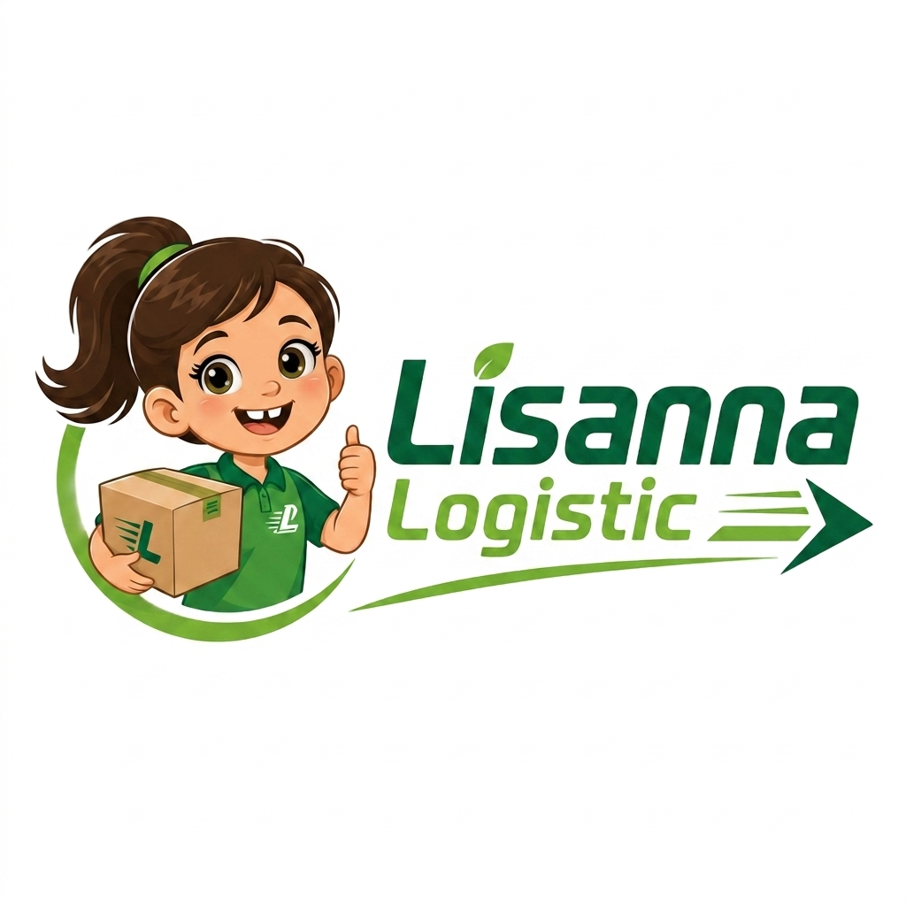

  
  <h1>📦 Lisanna Logistic (Logistik Nusantara)</h1>
  
<strong>Sistem Manajemen Pengiriman & Operasional Logistik Cerdas</strong>

  
  
  
  

## ✨ Fitur Unggulan

- 🚛 **Manajemen Cabang & Wilayah**: Integrasi API data wilayah otomatis untuk area Sulawesi (Sulawesi Selatan, Tengah, dan Tenggara).
- 📦 **Pembuatan Resi (AWB) Dinamis**: Pembuatan nomor resi otomatis yang cerdas dan anti-bentrok.
- 💰 **Kalkulasi Ongkir Cerdas**: Penghitungan tarif otomatis dengan *Pricing Rules* berdasarkan wilayah asal dan tujuan.
- 🚚 **Manifest Kendaraan**: Kelola jadwal keberangkatan, rute, dan daftar muatan setiap armada/kurir.
- 🔍 **Tracking Instan**: Pelacakan posisi paket secara *real-time* via Dasbor operasional yang *clean* dan super cepat.
- 📊 **Dashboard Analitik**: Ringkasan performa pengiriman hari ini (jumlah paket masuk, proses, tiba, hingga ongkir terkumpul) yang menggunakan gaya desain modern.

---

## ⚖️ Lisensi Hak Cipta

Aplikasi ini dirancang untuk penggunaan komersial dan dilindungi di bawah **Aladdin Free Public License**.
Dilarang keras menyalin, memodifikasi, menjual, atau mendistribusikan ulang *source code* maupun aset aplikasi ini tanpa izin resmi dari pemegang hak cipta **Logistik Nusantara / Lisanna Logistic**.

## 📚 Pusat Dokumentasi

Ingin menggali lebih dalam? Silakan baca direktori dokumentasi internal di `docs/`:
- 📖 **[Panduan Pengguna (USER_GUIDE)](docs/USER_GUIDE.md)** - Cara sakti pakai aplikasi.
- 🗄️ **[Arsitektur Database (DATABASE)](docs/DATABASE.md)** - Struktur tabel & relasi (*schema*).
- 🚀 **[Panduan Rilis (DEPLOYMENT)](docs/DEPLOYMENT.md)** - *Checklist* rahasia sebelum terbang ke *production*.
- 🧪 **[Catatan Uji Coba (QA)](docs/QA.md)** - Laporan pengujian aplikasi terbaru.

---

  Dibuat dengan ❤️ untuk masa depan operasional logistik.

